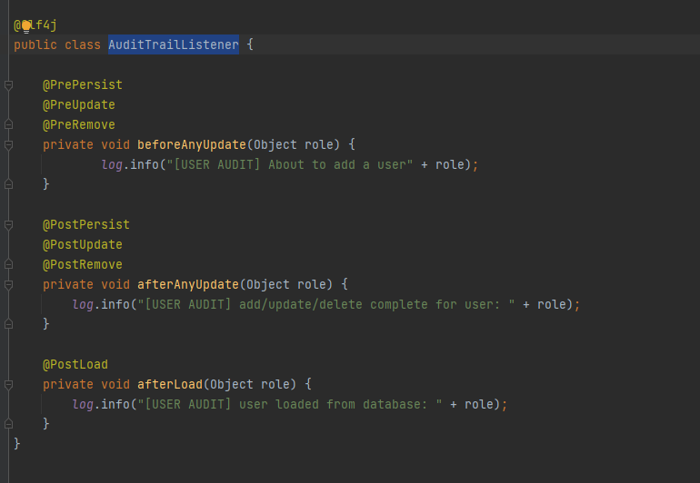
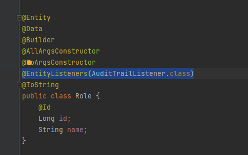
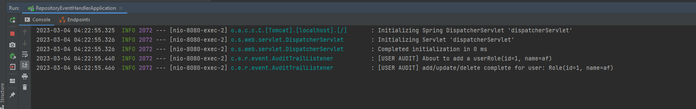

# Repository event handler

## Step 1: create `AuditTrailListener`

## Step 2: add `@EntityListeners(AuditTrailListener.class)` to model file

    curl --location 'localhost:8080/test?name=af'

Result

